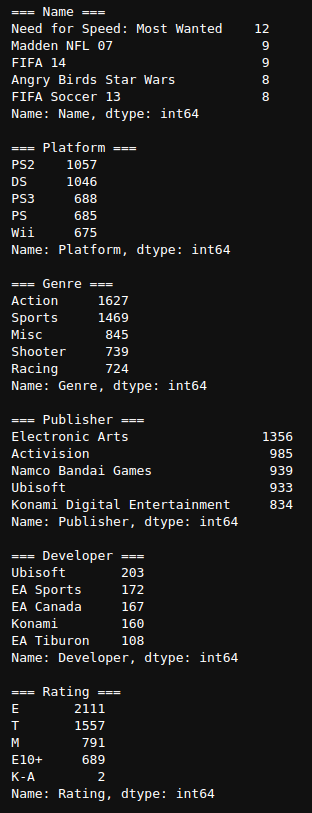

# atma-08-game
[atmacup #8](https://www.guruguru.science/competitions/13/) のリポジトリ

## Basics
- コンペ期間
    - 2020/12/04 18:00 ~ 2020/12/13 18:00 (Asia/Tokyo)

- Data
    - train.shape = (8359, 16)
    - test.shape = (8360, 11)

## Feture
|カラム名|	説明	|例|
|---|---|---|
|Name|	ソフトの名前	|Aquaman: Battle for Atlantis|
|Platform|	動作するプラットフォーム名	|XB|
|Year_of_Release	|発売された年度	||
|Genre|	ゲームのジャンル	|Action|
|Publisher|	発売元	|Unknown|
|Critic_Score|	https://www.metacritic.com/ でのレビュースコアのうち、評論家によるレビュースコア	|26|
|Critic_Count|	評論家によるレビュー数|	13|
|User_Score|	ユーザーによるレビュースコア	|2.7|
|User_Count|	ユーザーによるレビューの数	|15|
|Developer|	開発会社	|Lucky Chicken|
|Rating|	ゲームの https://www.esrb.org/ によるレーティング	|T|
|NA_Sales*|	北アメリカ(NorthAmerica)での販売量	|1|
|EU_Sales*|	ヨーロッパでの販売量	|0|
|JP_Sales*|	日本での販売量	|0|
|Other_Sales*|	上記以外の国と地域での販売量	|0|
|Global_Sales*|	世界全体での販売量	|1|

*はtrainにしかない

## Log
### 20201204
- Join!!!
- nb001
    - edaした
    - targetは `Global_Salse`
    - trainにあって、testにないカラム
        - ['JP_Sales', 'Global_Sales', 'NA_Sales', 'Other_Sales', 'EU_Sales']

- nb002
    - とりあえずモデル作る
    - 使った特徴量(nanはあるけど、他は数字の特徴量)
        - ['Critic_Score', 'Critic_Count', 'User_Count']
    - result
        - cv: 1.64816
        - sub: 	1.6045

- nb003
    - eda part2
    - User_Scoreについて
        - 数値に見えるが、'30'みたいに、ストリングが入ってた。
        - 'tbd'があるが、これは `To Be Determined` の略らしい。nanに置き換えよう。
        - nan は `hoge is np.nan` がTrueになるようだ。

- nb004 
    - nb003の解析を元にnot objectの特徴量でサブ
        - `use_col = ['Year_of_Release', 'Critic_Score', 'Critic_Count', 'User_Score', 'User_Count']`
    
    - result
        - cv: 1.51371

- nb005
    - string特徴量を見てみた
    - 特徴量名: `feat_string = ['Platform', 'Genre', 'Publisher', 'Developer', 'Rating']`
    - 以下testで見てる
    - nunique
        - 全体の数が8000程度なのでName以外そのまま使って良さそう
    
        

    - value_counts
        - この程度なら、そのままカテゴリカルにしてしまおう

        

- nb006
    - nb005のカテゴリカルな特徴量入れた
    - result
        - cv: 1.19139
        - sub: 1.4141

- nb007
    - nb006の改良
    - train_test_splitからkfoldにする
    - result
        - cv: 1.14436
        - sub: 1.3746

- nb008
    - nb007をリファクタリング

- nb009
    - nb008のlightGBMのハイパラチューニング
    - n_trial = 1,863
    - result
        - time: 2hぐらい
        - best_params = {'n_estimators': 800, 'max_depth': 55, 'subsample': 0.5, 'colsample_bytree': 0.9, 'learning_rate': 0.006437110612661787, 'reg_alpha': 5.0, 'reg_lambda': 5.0, 'min_child_samples': 57}

### 20200805
- tawaraさんの[discussion](https://www.guruguru.science/competitions/13/discussions/cbb736e9-f0f7-4847-811e-fe038e8ed0e8)
    - RMSLEの最適化
- nb010
    - nb008の改良
    - nb009で見つけたハイパラを利用する
    - result
        - cv: 1.09582
        - sub: 1.2656

- nb011
    - nb010の改良
    - tawaraさんのディスカッションを参考に最適化する
        - tawaraさんの[discussion](https://www.guruguru.science/competitions/13/discussions/cbb736e9-f0f7-4847-811e-fe038e8ed0e8)
    - result
        - cv: 0.87759
        - sub: 0.11804

### 20201207
- takapyさんのベン図の[ディスカッション](https://www.guruguru.science/competitions/13/discussions/9983c457-6fcc-4346-a6ae-6c5eb3e785ec/)
    - publisher、Name、Developerはそのまま使うのはまずそう

    - 

- nb012
    - nb011の改良
    - この[ディスカッション](https://www.guruguru.science/competitions/13/discussions/df06ef19-981d-4666-a0c0-22f62ee26640/)を見たところ、["Publisher", "Developer", "Name"] は学習から除いた方がいいそうなので除く。
    - result
        - cv: 1.00564
        - sub:0.9522   <--- publisher とか外したからめっちゃまともになった。

- nb013
    - nb012のリファクタリング
    - noglobal デコレータの導入
    - configでハイパラ管理

- nb014
    - optuna
    - ハイパラチューンングした。
    - best_params = {
        'max_depth': 131, 'subsample': 0.6, 'colsample_bytree': 0.9, 
        'learning_rate': 0.022862256818781214, 'reg_alpha': 1.0,
        'reg_lambda': 6.0, 'min_child_samples': 10
        }

- nb015
    - nb012と比較
    - nb014でチューニングしたハイパラを使用
    - result
        - cv: 1.00127
        - sub:0.9494

- nb016
    - hoge

- nb017
    - hoge
    - result
        - cv: 0.97241
        - sub: 0.9404